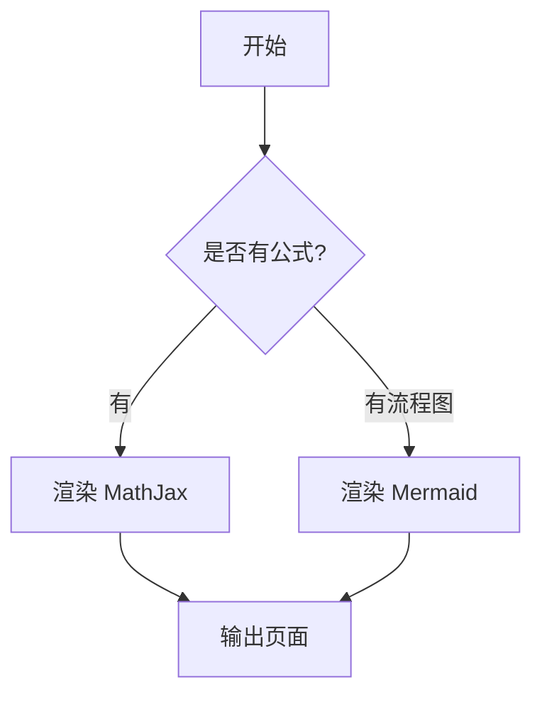
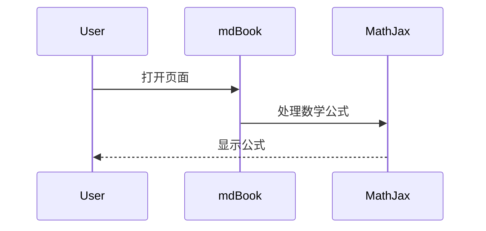

# 示例：数学与流程图

## 1. 行内与块级数学

- `$...$`：$\nabla\cdot\vec{E}=\frac{\rho}{\varepsilon_0}$
- `\(...\)`：\(\sum_{k=1}^{n}k=\frac{n(n+1)}{2}\)

$$
\left\{
\begin{aligned}
2x+y &= 1\\
x-y &= 3
\end{aligned}
\right.
$$

## 2. Mermaid 流程图

## 3. 时序图

